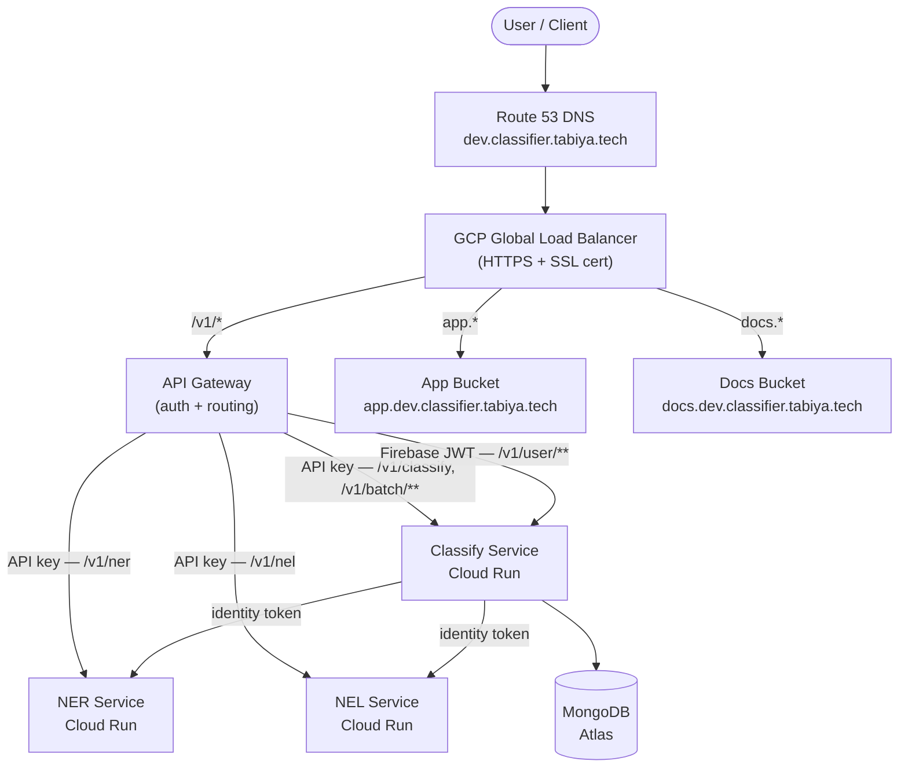

# Architecture

## Overview

Three Cloud Run microservices behind a GCP API Gateway, fronted by a global HTTPS load balancer. Two static frontends served from GCS. DNS managed in AWS Route 53.

## Request Flow



## Services

| Service | Role | Scales |
|---|---|---|
| **NER** | Extracts entities (occupations, skills, qualifications) from text using a fine-tuned RoBERTa model | 0–3 |
| **NEL** | Links extracted entities to ESCO taxonomy entries via semantic similarity (MiniLM embeddings) | 0–5 |
| **Classify** | Orchestrates NER → NEL, exposes the public API, handles auth, batch jobs, usage tracking | 1–10 |

All three services are reachable via the API Gateway. Classify also calls NER and NEL internally using GCP identity tokens (IAM-enforced).

## Authentication

- `/v1/classify/**`, `/v1/batch/**` — API key (`x-api-key` header), verified by API Gateway
- `/v1/user/**` — Firebase Bearer JWT, verified by API Gateway; decoded user info forwarded to Classify
- `/v1/health` — unauthenticated

Users manage API keys through the dashboard (app frontend).

## Infrastructure

- **Load balancer** — single static IP, three host-based backends, GCP-managed SSL, HTTP→HTTPS redirect
- **API Gateway** — OpenAPI 2.0 spec, dedicated service account to invoke Classify
- **Secrets** — HF token and MongoDB URI stored in GCP Secret Manager, injected as env vars
- **DNS** — All A records (`dev.*`, `app.dev.*`, `docs.dev.*`) in AWS Route 53 pointing to the LB IP

## CI/CD

Trigger: commit message containing `[deploy dev]`

```
push → backend CI (test + build images) ┐
     → frontend CI (build SPA bundles)  ┘→ deploy (Pulumi up: backend → frontend → common → aws-ns)
```

Pulumi stacks: `backend`, `frontend`, `common`, `aws-ns` (each independently deployable).
