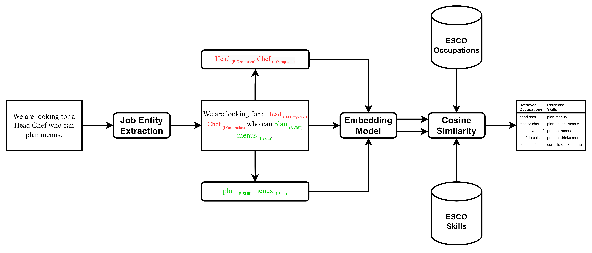

# Tabiya Livelihoods Classifier

The Tabiya Livelihoods Classifier provides an easy-to-use implementation of the entity-linking paradigm to support job description heuristics. Using state-of-the-art transformer neural networks, this tool can extract five entity types: Occupation, Skill, Qualification, Experience, and Domain. For the Occupations and Skills, ESCO-related entries are retrieved. The procedure consists of two discrete steps: entity extraction and similarity vector search.

## Table of Contents

- **[Installation](#installation)**
- **[Use the model](inference/README.md)**: Instructions on how to use the inference pipeline.
- **[Job Analysis Application](app/README.md)**: A web application for analyzing job descriptions and extracting and linking relevant entities.
- **[Training](train/README.md)**: Details on how to train the model.
- **[Model's Architecture](#models-architecture)**
- **[Datasets](#datasets)**
- **[License](#license)**
- **[Bibliography](#bibliography)**

## Installation

### Prerequisites

- A recent version of [git](https://git-scm.com/) (e.g. ^2.37 )
- [Python 3.10 or higher](https://www.python.org/downloads/)
- [Poerty 1.8 or higher](https://python-poetry.org/)
  > Note: to install Poetry consult the [Poetry documentation](https://python-poetry.org/docs/#installing-with-the-official-installer) 
  
  > Note: Install poetry system-wide (not in a virtualenv).
- [Git LFS](https://git-lfs.github.com/)

### Using Git LFS

This repository uses Git LFS for handling large files. Before you can use this repository, you need to install and set up Git LFS on your local machine.
See https://git-lfs.com/ for installation instructions.

After Git LFS is set up, follow these steps to clone the repository:

```shell
git clone https://github.com/tabiya-tech/tabiya-livelihoods-classifier.git
```

If you already cloned the repository without Git LFS, run:

```shell
git lfs pull
```

### Install the dependencies

#### Set up virtualenv
In the **root directory** of the backend project (so, the same directory as this README file), run the following commands:

```shell
# create a virtual environment
python3 -m venv venv

# activate the virtual environment
source venv/bin/activate
```

```shell
# Use the version of the dependencies specified in the lock file
poetry lock --no-update
# Install missing and remove unreferenced packages
poetry install --sync
```

> Note:
> Install the dependencies for the training using:
>  ```shell
> # Use the version of the dependencies specified in the lock file
> poetry lock --no-update
> # Install missing and remove unreferenced packages
> poetry install --sync --with train
>  ```

> Note:
> Before running any tasks, activate the virtual
> environment so that the installed dependencies are available:
>  ```shell
>  # activate the virtual environment
>  source venv/bin/activate
>  ```
> To deactivate the virtual environment, run:
> ```shell
> # deactivate the virtual environment
> deactivate
> ```

Activate Python and download the NLTK punctuation package to use the sentence tokenizer. You only need to download `punkt` once.

```shell
python <<EOF
import nltk
nltk.download('punkt')
EOF
```

### Environment Variable & Configuration

The repo uses the following environment variable:

- `HF_TOKEN`: To use the project, you need access to the HuggingFace 🤗 entity extraction model. Contact the administrators via [tabiya@benisis.de]. From there, you need to create a read access token to use the model. Find or create your read access token [here](https://huggingface.co/settings/tokens).
The backend supports the use of a `.env` file to set the environment variable. Create a `.env` file in the root
directory of the backend project and set the environment variables as follows:

```dotenv
# .env file
HF_TOKEN=<YOUR_HF_TOKEN>
```

> ATTENTION: The .env file should be kept secure and not shared with others as it contains sensitive information.
> It should not be committed to the repository.

- **[Use the model](inference/README.md)**: Instructions on how to use the inference tool.
- **[Use the API](app/README.md)**: Instructions on how to use the API.
- **[Training](train/README.md)**: Details on how to train the model.

## Model's Architecture



## License

The code and model weights are licensed under the MIT License. See the [LICENSE](./LICENSE) file for details.

The [datasets](#Datasets) are licensed under the Creative Commons Attribution 4.0 International (CC BY 4.0). See the [DATA_LICENSE](./DATA_LICENSE) file for details.

## Datasets

### Occupations
- **Location**:  [inference/files/occupations_augmented.csv](inference/files/occupations_augmented.csv)
- **Source**: [ESCO dataset - v1.1.1](https://esco.ec.europa.eu/en/use-esco/download)
- **Description**: ESCO (European Skills, Competences, Qualifications and Occupations) is the European multilingual classification of Skills, Competences, and Occupations. This dataset includes information relevant to the occupations.
- **License**: Creative Commons Attribution 4.0 International see [DATA_LICENSE](./DATA_LICENSE) for details.
- **Modifications**: The columns retained are `alt_label`, `preferred_label`, `esco_code`, and `uuid`. Each alternative label has been separated into individual rows.

### Skills
- **Location**: [inference/files/skills.csv](inference/files/skills.csv)
- **Source**: [ESCO dataset - v1.1.1](https://esco.ec.europa.eu/en/use-esco/download)
- **Description**: ESCO (European Skills, Competences, Qualifications and Occupations) is the European multilingual classification of Skills, Competences and Occupations. This dataset includes information relevant to the skills.
- **License**: Creative Commons Attribution 4.0 International see [Data License](./DATA_LICENSE) for details.
- **Modifications**: The columns retained are `preferred_label` and `uuid`.

### Qualifications
- **Location**: [inference/files/qualifications.csv](inference/files/qualifications.csv)
- **Source**: [Official European Union EQF comparison website](https://europass.europa.eu/en/compare-qualifications)
- **Description**: This dataset contains EQF (European Qualifications Framework) relevant information extracted from the official EQF comparison website. It includes data strings, country information, and EQF levels. Non-English text was ignored.
- **License**: Please refer to the original source for [license information](https://europass.europa.eu/en/node/2161).
- **Modifications**: Non-English text was removed, and the remaining information was formatted into a structured database.

### Hahu Test
- **Location**: [inference/files/eval/redacted_hahu_test_with_id.csv](inference/files/eval/redacted_hahu_test_with_id.csv)  
- **Source**: [hahu_test](https://huggingface.co/datasets/tabiya/hahu_test)
- **Description**: This dataset consists of 542 entries chosen at random from the 11 general classification system of the Ethiopian hahu jobs platform. 50 entries were selected from each class to create the final dataset.
- **License**: Creative Commons Attribution 4.0 International see [Data License](./DATA_LICENSE) for details.
- **Modifications**: No modifications were made to the selected entries.

### House and Tech
- **Location**: 
  - [inference/files/eval/house_test_annotations.csv](inference/files/eval/house_test_annotations.csv)
  - [inference/files/eval/house_validation_annotations.csv](inference/files/eval/house_validation_annotations.csv)
  - [inference/files/eval/tech_test_annotations.csv](inference/files/eval/tech_test_annotations.csv)
  - [inference/files/eval/tech_validation_annotations.csv](inference/files/eval/tech_validation_annotations.csv)
- **Source**: Provided by [Decorte et al.](https://arxiv.org/abs/2209.05987)
- **Description**: The dataset includes the HOUSE and TECH extensions of the SkillSpan Dataset. In the original work by Decorte et al., the test and development entities of the SkillSpan Dataset were annotated into the ESCO model.
- **License**: MIT, Please refer to the original source.
- **Modifications**: The datasets were used as provided without further modifications.

### Qualification Mapping
- **Location**: [inference/files/eval/qualification_mapping.csv](inference/files/eval/qualification_mapping.csv)
- **Source**: Extended from the [Green Benchmark](https://github.com/acp19tag/skill-extraction-dataset) Qualifications
- **Description**: This dataset maps the Green Benchmark Qualifications to the appropriate EQF levels. Two annotators tagged the qualifications, resulting in a Cohen's Kappa agreement of 0.45, indicating moderate agreement.
- **License**: Creative Commons Attribution 4.0 International see [Data License](./DATA_LICENSE) for details.
- **Modifications**: Extended the dataset to include EQF level mappings, and the annotations were verified by two annotators.

### Access and Usage

To use these datasets, ensure you comply with the original dataset's license and terms of use. Any modifications made should be documented and attributed appropriately in your project.

For datasets requiring access tokens, such as those from HuggingFace 🤗, please contact the maintainers to obtain a read access token.

## Bibliography

A list on interesting and relevant material for reading:
* **GPT NER** [GPT-NER: Named Entity Recognition via Large Language Models](https://arxiv.org/pdf/2304.10428) (Shuhe Wang)
* **Skill Extraction with LLMs** [Rethinking Skill Extraction in the Job Market Domain using Large Language Models](https://arxiv.org/pdf/2402.03832) (Mike Zhang)
* **NER annotation with LLM** [LLMs Accelerate Annotation for Medical Information Extraction](https://proceedings.mlr.press/v225/goel23a)
* **Skills Entity Linking** Zhang, Mike, Rob van der Goot, and Barbara Plank. "Entity Linking in the Job Market Domain." arXiv preprint arXiv:2401.17979 (2024). 
* **Skills-ML** is an open-source Python library for developing and analyzing skills and competencies from unstructured text. (link: http://dataatwork.org/skills-ml/)   
* **SkillSpan**: Hard and Soft Skill Extraction from English Job Postings https://arxiv.org/abs/2204.12811 (Mike Zhang)
* **work2vec**: Using the full text of data from 200 million online job postings, we train and evaluate a natural language processing (NLP) model to learn the language of jobs. We analyze how jobs have changed in the past decade, and show how different words in the posting denote different occupations. We use this approach to create novel indexes of jobs, such as work-from-home ability. In ongoing work, we quantify the return to various skills. 
  
  https://digitaleconomy.stanford.edu/research/job2vec/
  https://digitaleconomy.stanford.edu/people/sarah-h-bana/
* **Data Science and ESCO** Insights into how ESCO is leveraging data-science techniques. https://esco.ec.europa.eu/en/about-esco/data-science-and-esco  
* **Machine Learning Assisted Mapping of Multilingual Occupational Data to ESCO**: A report that discusses the multilingual mapping
approach that the ESCO team established to support the maintenance of ESCO.  https://esco.ec.europa.eu/en/about-esco/publications/publication/machine-learning-assisted-mapping-multilingual-occupational
* **ESCO Publications**: Artificial intelligence & machine learning. https://esco.ec.europa.eu/en/about-esco/publications?f%5B0%5D=theme%3A109860&page=0  
